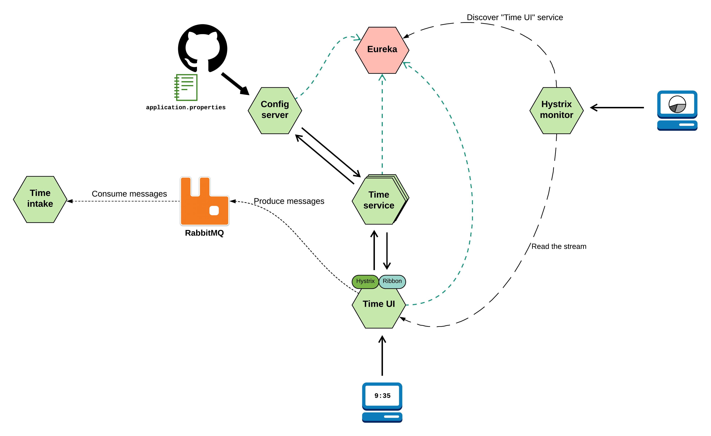

# Time UI
This is a simple silly UI for the time application. This application simply returns the current time in a given
format that can be configured.

The whole thing is an exercise to learn the basics of Spring Cloud, including Netflix Eureka, Spring Config, Spring
Boot, etc.

The (over-engineered system) consists of:

* [`time-eureka-server`](https://github.com/Time-app-with-Spring-Cloud/time-eureka-server): Eureka server where to register all the different microservices.
* [`time-config-server`](https://github.com/Time-app-with-Spring-Cloud/time-config-server): A place where to store the configuration of the different microservices.
* [`time-service`](https://github.com/Time-app-with-Spring-Cloud/time-service): A microservice that returns the current date in the configured format.
* [`time-ui`](https://github.com/Time-app-with-Spring-Cloud/time-ui): An user interface to show the current date obtained from `time-service`.
* [`time-hystrix-dashboard`](https://github.com/Time-app-with-Spring-Cloud/time-hystrix-dashboard): Hystrix dashboard to monitor the `time-ui` circuit breakers.



## Endpoints

There is a single endpoint that will return the current time.

```
$ curl http://localhost:8080
<!DOCTYPE html>

<html>

<head>
    <title>Time</title>
    <meta http-equiv="Content-Type" content="text/html; charset=UTF-8" />
    <link rel="stylesheet" type="text/css" media="all"
          href="https://stackpath.bootstrapcdn.com/bootstrap/4.3.1/css/bootstrap.min.css" integrity="sha384-ggOyR0iXCbMQv3Xipma34MD+dH/1fQ784/j6cY/iJTQUOhcWr7x9JvoRxT2MZw1T" crossorigin="anonymous" />
</head>

<body>

<p>Time: 11/06/2020 12:53:18(from time-service:-1058842977)</p>

</body>

</html>
```